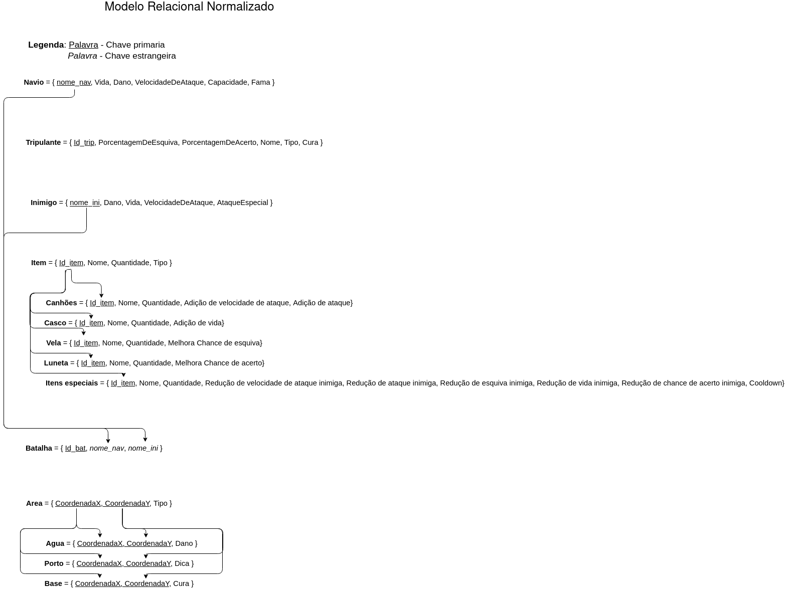

# Normalização

## Primeira Forma Normal
**(Todos os atributos tem que ser atômicos e Monovalorados)**

## Segunda Forma Normal
**(Atributos comuns não dependem parcialmente de nenhuma chave)**

## Terceira Forma Normal
**(Atributos comuns não dependem transitivamente de qualquer superchave)**

## Quarta Forma Normal
**(Atributos comuns não dependem transitivamente de qualquer superchave)**

---

