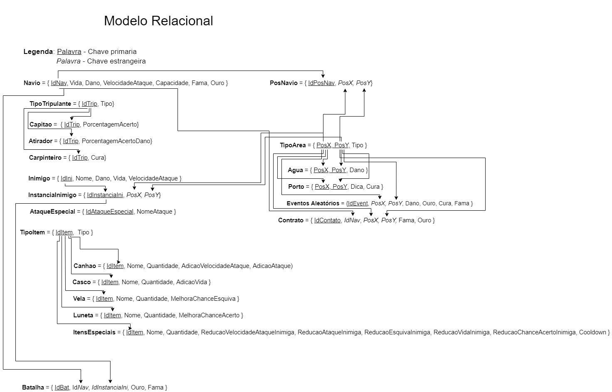

# Normalização

## Legenda

- **Chave Primaria**
- *Chave estrangeira*

## Normalizações

### Primeira Forma Normal

**(Todos os atributos tem que ser atômicos e Monovalorados)**

### Segunda Forma Normal

**(Atributos comuns não dependem parcialmente de nenhuma chave)**

### Terceira Forma Normal

**(Atributos comuns não dependem transitivamente de qualquer superchave)**

### Forma Normal de Boyce Codd

**(Toda dependência funcional X->A, X é uma chave candidata)**

### Quarta Forma Normal

**(Atributos não possuem depedências funcionais multivaloradas)**

## Fazendo a analize

## Navio

- Navio (**IdNav**, Vida, Dano, VelocidadeAtaque, Capacidade, Fama, Ouro)

| Formas     | Normalizado/Não-Normalizado |
| ---------- | -----:                      |
| 1a. FN     | Normalizado                 |
| 2a. FN     | Normalizado                 |
| 3a. FN     | Normalizado                 |
| Boyce Codd | Normalizado                 |
| 4a. FN     | Normalizado                 |

## TipoTripulante

- TipoTripulante (**IdTrip**, Tipo)

| Formas     | Normalizado/Não-Normalizado |
| ---------- | -----:                      |
| 1a. FN     | Normalizado                 |
| 2a. FN     | Normalizado                 |
| 3a. FN     | Normalizado                 |
| Boyce Codd | Normalizado                 |
| 4a. FN     | Normalizado                 |

## Capitao

- Capitao (**IdTrip**, PorcentagemAcerto)

| Formas     | Normalizado/Não-Normalizado |
| ---------- | -----:                      |
| 1a. FN     | Normalizado                 |
| 2a. FN     | Normalizado                 |
| 3a. FN     | Normalizado                 |
| Boyce Codd | Normalizado                 |
| 4a. FN     | Normalizado                 |

## Atirador

- Atirador (**IdTrip**, PorcentagemAcertoDano)

| Formas     | Normalizado/Não-Normalizado |
| ---------- | -----:                      |
| 1a. FN     | Normalizado                 |
| 2a. FN     | Normalizado                 |
| 3a. FN     | Normalizado                 |
| Boyce Codd | Normalizado                 |
| 4a. FN     | Normalizado                 |

## Carpinteiro

- Carpinteiro (**IdTrip**, Cura)

| Formas     | Normalizado/Não-Normalizado |
| ---------- | -----:                      |
| 1a. FN     | Normalizado                 |
| 2a. FN     | Normalizado                 |
| 3a. FN     | Normalizado                 |
| Boyce Codd | Normalizado                 |
| 4a. FN     | Normalizado                 |

## Inimigo

- Inimigo (**IdIni**, Nome, Dano, Vida, VelocidadeAtaque)

| Formas     | Normalizado/Não-Normalizado |
| ---------- | -----:                      |
| 1a. FN     | Normalizado                 |
| 2a. FN     | Normalizado                 |
| 3a. FN     | Normalizado                 |
| Boyce Codd | Normalizado                 |
| 4a. FN     | Normalizado                 |

## InstanciaInimigo

- InstanciaInimigo (**IdInstanciaIni**, *PosX*, *PosY*)

| Formas     | Normalizado/Não-Normalizado |
| ---------- | -----:                      |
| 1a. FN     | Normalizado                 |
| 2a. FN     | Normalizado                 |
| 3a. FN     | Normalizado                 |
| Boyce Codd | Normalizado                 |
| 4a. FN     | Normalizado                 |

## AtaqueEspecial

- AtaqueEspecial (**IdAtaqueEspecial**, NomeAtaque)

| Formas     | Normalizado/Não-Normalizado |
| ---------- | -----:                      |
| 1a. FN     | Normalizado                 |
| 2a. FN     | Normalizado                 |
| 3a. FN     | Normalizado                 |
| Boyce Codd | Normalizado                 |
| 4a. FN     | Normalizado                 |

## TipoItem

- TipoItem (**IdItem**, Tipo)

| Formas     | Normalizado/Não-Normalizado |
| ---------- | -----:                      |
| 1a. FN     | Normalizado                 |
| 2a. FN     | Normalizado                 |
| 3a. FN     | Normalizado                 |
| Boyce Codd | Normalizado                 |
| 4a. FN     | Normalizado                 |

## Canhao

- Canhao (**IdItem**, Nome, Quantidade, AdicaoVelocidadeAtaque, AdicaoAtaque)

| Formas     | Normalizado/Não-Normalizado |
| ---------- | -----:                      |
| 1a. FN     | Normalizado                 |
| 2a. FN     | Normalizado                 |
| 3a. FN     | Normalizado                 |
| Boyce Codd | Normalizado                 |
| 4a. FN     | Normalizado                 |

## Casco

- Casco (**IdItem**, Nome, Quantidade, AdicaoVelocidadeAtaque, AdicaoAtaque)

| Formas     | Normalizado/Não-Normalizado |
| ---------- | -----:                      |
| 1a. FN     | Normalizado                 |
| 2a. FN     | Normalizado                 |
| 3a. FN     | Normalizado                 |
| Boyce Codd | Normalizado                 |
| 4a. FN     | Normalizado                 |

## Vela

- Vela (**IdItem**, Nome, Quantidade, MelhoraChanceEsquiva)

| Formas     | Normalizado/Não-Normalizado |
| ---------- | -----:                      |
| 1a. FN     | Normalizado                 |
| 2a. FN     | Normalizado                 |
| 3a. FN     | Normalizado                 |
| Boyce Codd | Normalizado                 |
| 4a. FN     | Normalizado                 |

## Luneta

- Luneta (**IdItem**, Nome, Quantidade, MelhoraChanceAcerto)

| Formas     | Normalizado/Não-Normalizado |
| ---------- | -----:                      |
| 1a. FN     | Normalizado                 |
| 2a. FN     | Normalizado                 |
| 3a. FN     | Normalizado                 |
| Boyce Codd | Normalizado                 |
| 4a. FN     | Normalizado                 |

## ItensEspeciais

- ItensEspeciais (**IdItem**, Nome, Quantidade, ReducaoVelocidadeAtaqueInimiga, ReducaoAtaqueInimiga, ReducaoEsquivaInimiga, ReducaoVidaInimiga, ReducaoChanceAcertoInimiga, Cooldown)

| Formas     | Normalizado/Não-Normalizado |
| ---------- | -----:                      |
| 1a. FN     | Normalizado                 |
| 2a. FN     | Normalizado                 |
| 3a. FN     | Normalizado                 |
| Boyce Codd | Normalizado                 |
| 4a. FN     | Normalizado                 |

## Batalha

- Batalha (**IdBat**, *IdNav*, *IdInstanciaIni*, Ouro, Fama)

| Formas     | Normalizado/Não-Normalizado |
| ---------- | -----:                      |
| 1a. FN     | Normalizado                 |
| 2a. FN     | Normalizado                 |
| 3a. FN     | Normalizado                 |
| Boyce Codd | Normalizado                 |
| 4a. FN     | Normalizado                 |

## PosNavio

- PosNavio (**IdPosNav**, *PosX*, *PosY*)

| Formas     | Normalizado/Não-Normalizado |
| ---------- | -----:                      |
| 1a. FN     | Normalizado                 |
| 2a. FN     | Normalizado                 |
| 3a. FN     | Normalizado                 |
| Boyce Codd | Normalizado                 |
| 4a. FN     | Normalizado                 |

## TipoArea

- TipoArea (**PosX**, **PosY**, Tipo)

| Formas     | Normalizado/Não-Normalizado |
| ---------- | -----:                      |
| 1a. FN     | Normalizado                 |
| 2a. FN     | Normalizado                 |
| 3a. FN     | Normalizado                 |
| Boyce Codd | Normalizado                 |
| 4a. FN     | Normalizado                 |

## Agua

- Agua (**PosX**, **PosY**, Dano)

| Formas     | Normalizado/Não-Normalizado |
| ---------- | -----:                      |
| 1a. FN     | Normalizado                 |
| 2a. FN     | Normalizado                 |
| 3a. FN     | Normalizado                 |
| Boyce Codd | Normalizado                 |
| 4a. FN     | Normalizado                 |

## Porto

- Porto (**PosX**, **PosY**, Dica, Cura)

| Formas     | Normalizado/Não-Normalizado |
| ---------- | -----:                      |
| 1a. FN     | Normalizado                 |
| 2a. FN     | Normalizado                 |
| 3a. FN     | Normalizado                 |
| Boyce Codd | Normalizado                 |
| 4a. FN     | Normalizado                 |

## EventosAleatorios

- EventosAleatorios (**IdEvent**, *PosX*, *PosY*, Dano, Ouro, Cura, Fama)

| Formas     | Normalizado/Não-Normalizado |
| ---------- | -----:                      |
| 1a. FN     | Normalizado                 |
| 2a. FN     | Normalizado                 |
| 3a. FN     | Normalizado                 |
| Boyce Codd | Normalizado                 |
| 4a. FN     | Normalizado                 |

## Contrato

- Contrato (**IdContato**, *IdNav*, *PosX*, *PosY*, Fama, Ouro )

| Formas     | Normalizado/Não-Normalizado |
| ---------- | -----:                      |
| 1a. FN     | Normalizado                 |
| 2a. FN     | Normalizado                 |
| 3a. FN     | Normalizado                 |
| Boyce Codd | Normalizado                 |
| 4a. FN     | Normalizado                 |

---

